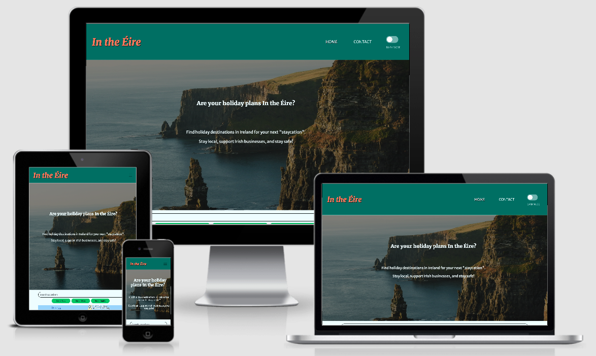

# In the Éire - Find "staycations" in Ireland

[View the deployed site here.](https://adowlin.github.io/project-2-staycations/)

In the Éire is a website where users can search for holiday destinations within Ireland. This website was created for my second milestone project as part of the Diploma in Full Stack Software Development course with Code Institute. The website is responsive on all device sizes.


 
## User Experience (UX)

With international travel restrictions throughout the COVID-19 pandemic, "staycations" - holidays within Ireland - have grown in popularity. This website will allow users to search for holiday destinations within Ireland. It will provide information about accommodation, restaurants, and attractions near the locations that users will search for. The website will advance the user's goals of finding holiday destinations in Ireland by providing this search feature. It will also advance the site owner's goals of promoting Irish businesses, and finding holiday destinations being a user of the site themselves.

### User Stories

- As a first-time visitor, I want to:
    - Search for holiday destinations in Ireland.
    - See places of interest and attractions near my preferred destination.
    - Find & book accomodation & restaurants near my preferred destination.
    - Contact the site owner with any questions.

- As a returning visitor, I want to:
    - Search for new holiday destinations in Ireland.
    - Find restaurants & attractions near my current location, if I am already on holiday.

### Design

- Colour Scheme:

    

    - Colour palette was generated using [coolors.co](https://coolors.co/). I chose this colour scheme as it offers sufficient contrasts, and aligns with the Irish theme of the site by using colours similar to the Irish Tricolour.

- Typography:
    - Using [Google Fonts](https://fonts.google.com/), I chose [Merriweather](https://fonts.google.com/specimen/Merriweather) for the site's logo and headings, paired with [Merriweather Sans](https://fonts.google.com/specimen/Merriweather+Sans) for the site's main text.

- Images:
    - Used [Unsplash](https://unsplash.com/) to find images of Irish scenery.

### Wireframes

- Wireframes were created using [Balsamiq](https://balsamiq.com/):

    - [Wireframes PDF](/readme-assets/staycations-wireframes.pdf)

- Flowchart created using [draw.io](https://app.diagrams.net/):

    - [Flowchart PDF](/readme-assets/staycations-flowchart.pdf)

## Features

### Existing Features

- **Front Page with image carousel & lead text:** Allows users to see various sites around Ireland, while the lead text briefly explains the purpose of the site to new users.
- **Collapsable nav bar links:** Allows users to navigate between the home page & contact page without needing to use their browser navigation buttons. Nav links collapse into a hamburger button on smaller screens to improve responsiveness.
- **Dark mode theme slider:** Included in the nav bar links, allows users to toggle between dark & light mode themes of the site, depending on their preference.
- **Searchbar input & buttons:** Allows users to search for their desired locations within Ireland, buttons allow users to filter the returned search results by food, accomodation, and attractions.
- **Google Map window:** Centers on the user's search location, and re-centers on each place in the list of search results when a list item is clicked. Allows users to visualise the location of each place as they work down through the list of search results.
- **Google Places search results list:** Returns a list of nearby food establishments, accomodation, or tourist attractions, nearby to the location which the user has searched. Allows users to click on the list item for each result to display that place on the map. Also included a "Load More Results" button to allow the user to extend the list to include more search results.
- **"Details" link on each search result item:** Allows users to find out more information about, and possibly book, the places in the  results list. Opens a Google search for the place in a new browser tab.
- **Footer:** Contains links to the Contact page, and links to the hypothetical social media profiles for the website/site owner, allowing for easy navigation.
- **Contact Page image carousel with lead text:** Displays more photos from sites around Ireland, and explains the purpose of the Contact Page.
- **Contact form with EmailJS:** Allows users to send an email to the site owner, while validating the information input into the form.
- **Success/Failure alert box for contact form:** Displays a message to users to inform them of whether their attempt to send an email via the form was successful or not.

## Technologies Used

- Languages Used:
    - [HTML5](https://en.wikipedia.org/wiki/HTML5)
    - [CSS3](https://en.wikipedia.org/wiki/CSS)
    - [JavaScript](https://en.wikipedia.org/wiki/JavaScript)

- Frameworks, Libraries, Programs Used:
    - [Bootstrap v5.0](https://getbootstrap.com/docs/5.0):
        - Used to help with styling, responsiveness & structure of the site.
    - [JQuery v3.6.0](https://jquery.com/):
        - Used to help reduce complexity of JavaScript code in places.
    - [Google Fonts](https://fonts.google.com/):
         - Used to import [Merriweather](https://fonts.google.com/specimen/Merriweather) and [Merriweather Sans](https://fonts.google.com/specimen/Merriweather+Sans) fonts.
    - [FontAwesome](https://fontawesome.com/):
        - Used to add social media icons to footer links.
    - [Gitpod](https://www.gitpod.io/):
        - Used for the site's development environment.
    - [Git](https://git-scm.com/):
        - Used via the Gitpod terminal to make regular commits, and push to GitHub.
    - [GitHub](https://github.com/) & [GitHub Pages](https://pages.github.com/):
        - Used to store the site's code & to host the deployed site.

## Testing

The [W3C Markup Validator](https://validator.w3.org/), [W3C CSS Validator](https://jigsaw.w3.org/css-validator/), and [JSHint](https://jshint.com/) services were used to validate all code used on this site, and to ensure that no syntax or logic errors were present.

### Testing User Stories from User Experience (UX) section

- As a first-time visitor, I want to;
    1. Search for holiday destinations in Ireland:
        - Upon entering the site, I am greeted with visual images of Irish scenery, which provide encouragement and inspiration to book an Ireland-based holiday.
        - Upon entering the site, I am shown information in the lead text about how to use the site to find a holiday destination in Ireland, and should notice the presence of a search bar at the bottom of the viewport.
        - When scrolling down the front page of the site, I am intuitively invited to search for a location in Ireland in the search bar.
        - The presence of a Google Map box intuitively shows me that I will be able to see locations in Ireland on the map.
    2. See places of interest and attractions near my preferred destination:
        - With the presence of 3 search buttons, I see that there is an option to filter search results to show "Sights" near the location that I have searched for.
    3. Find & book accomodation & restaurants near my preferred destination:
        - Similarly, the 3 search buttons also present me with the options to filter my search results by "Food" and "Stays" - to search for restaurants and accommodation near the location that I have entered into the search bar.
        - Upon viewing the list of search results for either food or accomodation near my search location, I am presented with an intuitive "Details" link for each search result.
        - Upon clicking the "Details" link, I am brought to a Google search results page in a new tab, which provides me with the relevant information and website links in order to make bookings with restaurants, hotels, B&Bs, hostels, etc.
    4. Contact the site owner with any questions:
        - When first viewing the site, I can see a link to the "Contact" page in the navigation links.
        - When I scroll to the bottom of the site's front page, I find another link to the site's "Contact" page, along with links to the site's social media profiles.
        - Upon visiting the site's "Contact" page, I am presented with information about how to get in touch with the site owner, by using the page's embedded contact form.
        - Upon filling in the contact form, I am presented with intuitive popovers if the information I have entered is in an incorrect format for the current form input type.
        - When I submit the form, I am presented with a browser alert box, which informs me if my query has been sent successfully, or if I need to try to send my query again later.

- As a returning visitor, I want to;
    1. Search for new holiday destinations in Ireland:
        - Upon re-entering the site, I can scroll immediately to the search function, which allows me to search for a new location within Ireland.
    2. Find restaurants & attractions near my current location, if I am already on holiday:
        - Upon re-entering the site, I can re-enter my location in the search bar, and search for only restaurants, or only attractions, by utilising the relevant search button underneath the search bar.

### Further Testing

The website's functionality was tested across multiple browsers and device types. This ensures that it is responsive across a wide range of device sizes, and that the code used is supported by a wide range of browsers.

- Browsers tested:
    - Chrome (Windows, macOS, iOS, Android)
    - Safari (macOS, iOS)
    - Microsoft Edge (Windows, macOS)
    - Internet Explorer (Windows)
    - Firefox (Windows, macOS)
    - Samsung Browser (Android)
- Devices tested:
    - iPhone XS
    - Samsung Galaxy Edge
    - Desktop PC
    - Laptop
    - Tablet

- All links, buttons, and features worked as expected on all of the above listed browsers and device types.
- The website was found to be fully responsive on all device sizes ranging from 275px X 400px to 1920px X 1080px.
- The website and it's documentation were reviewed by family and friends, to double check for grammatical errors & missed bugs, and to test the user experience.

### Known Bugs

- Location search feature does not allow users to search for locations in Northern Ireland:
    - The Google Map bounds are set to include Northern Ireland, and it was intended that the search feature would extend to Northern Ireland locations. However, due to Google's geocoder restrictions being limited to using country ISO codes, it is not possible to include Northern Ireland in the geocoder restrictions, as it falls under the GB ISO code.
    - Including GB in the geocoder restrictions would result in the allowed search locations to be extended to include all of the United Kingdom, including mainland UK. This would mean that a user would be able to search for a mainland UK location, without receiving an error message, but the map would simply render an all blue map (screenshot below), since the location would be outside of the map bounds.
    - With this in mind, I found that it would be a better user experience to ultimately not include Northern Ireland in the allowable search locations, to avoid confusion on the user's end.

### Bugs Found & Fixed

- When the dark mode theme was applied to the page before a search took place, when the search was initiated the list of results had it's light mode theme applied, instead of it's dark mode theme.
    - This was fixed by adding an if statement to the maps.js file. This statement checks if dark mode is already enabled before a search is initiated, if so then it sets the results list style to it's dark mode theme:
    ```javascript
    let darkModeStatus = body.classList.contains('body-dark-mode');
    if (darkModeStatus) {
        li.classList.toggle('body-dark-mode');
        placeLinkUrl.classList.toggle('link-light-mode');
        placeLinkUrl.classList.toggle('link-dark-mode');
    }
    ```

- When dark mode was enabled on one page of the site, navigating to another site page, or reloading the original page, would result in the default light mode theme being applied to the page. This meant that a user would need to enable dark mode individually for each page separately, and they would need to re-enable dark mode after reloading a page.
    - This was fixed by adding a value to the Window `sessionStorage` property if dark mode was enabled, and removing that `sessionStorage` value if dark mode was disabled.
    - Then, an if statement was added to simulate a click event on the dark mode switch if the dark mode value was present in `sessionStorage`:
    ```javascript
    let darkModeStatus = body.classList.contains('body-dark-mode');
    let darkModeSwitch = document.getElementById("dark-mode-slider");
    if (darkModeStatus) {
        sessionStorage.setItem('darkModeActive', 'true'); //saves a value to session storage when dark mode is enabled
    } else {
        sessionStorage.removeItem('darkModeActive'); //removes the saved value from session storage when dark mode is disabled
    }
    if (sessionStorage.getItem('darkModeActive') === "true") {
        darkModeSwitch.click();
    }
    ```

- When a search is initiated, the search results are displayed on the map with icons representing the type of place (i.e. restauant, accomodation, attraction). However, if a new search in the same location is initiated for a different type of result (e.g.: first searching for restaurants in Cork, then searching for accomodation in Cork), the icons from the previous search type remained on the map (icons for restaurants are displayed along with icons for accomodations).
    - This was fixed by simply calling the `initialize();` function each time a search button is clicked, which results in the map re-loading, and the old search result markers no longer appear.

## Deployment

The project used the [Gitpod](https://www.gitpod.io/) environment during development, and used Git to commit and push to GitHub, using the terminal feature within GitPod.

### GitHub Pages

The project was deployed to GitHub Pages following the below steps:

1. Log in to GitHub and locate the [repository](https://github.com/adowlin/project-2-staycations).
2. In the Repository's nav menu, click on the "Settings" button.
3. Scroll down in the Settings page to the "GitHub Pages" section.
4. Click the dropdown labelled "None" under "Source", and select the "Master" branch.
5. Click the "Save" button, the page will automatically refresh.
6. Scroll down the page again to the "GitHub Pages" section to locate the now published [link](https://adowlin.github.io/project-2-staycations/).

### Local Deployment

To run this project using Gitpod, you will need to use the Google Chrome browser, and [a GitHub account](https://github.com/). Then, follow the below steps:

1. Install the [Gitpod Chrome Browser Extension](https://chrome.google.com/webstore/detail/gitpod-dev-environments-i/dodmmooeoklaejobgleioelladacbeki?hl=en).
2. Log in to [Gitpod](https://gitpod.io/) using your GitHub account.
3. Head to this project's [GitHub Repository](https://github.com/adowlin/project-2-staycations).
4. Click the green "Gitpod" button that now appears in the top right corner of the repository, which creates a new Gitpod workspace using the code from the GitHub repo.
5. In the Gitpod workspace's terminal window, run the command `python3 -m http.server` to deploy a local version of the site.
6. Click on the "Open Ports" tab, then click the "Open Browser" button on port 8000 to open the local deployment preview in a new browser tab.

To run this project using a local IDE, for example VSCode, follow these steps to clone the project:

1. Locate the project's [repository](https://github.com/adowlin/project-2-staycations) in GitHub.
2. Above the list of files, click the "Code" button.
3. To clone the repository using HTTPS, copy the link under "HTTPS" in the dropdown box.
4. Open Git Bash and change the current working directory to the location you want the cloned directory to be.
5. Type git clone, and paste the URL copied in Step 3, then press entering.
6. Your local clone will be created.

## Credits

### Content

- JavaScript for map search functionality[0], styled map types functionality[1], night mode map styling[2], and nearby search functionality with pagination[3] adapted from Google Developer Docs: <br>
    [0] https://developers.google.com/maps/documentation/javascript/examples/places-searchbox#maps_places_searchbox-html <br>
    [1] https://developers.google.com/maps/documentation/javascript/examples/maptype-styled-simple <br>
    [2] https://developers.google.com/maps/documentation/javascript/examples/style-array#maps_style_array-javascript <br>
    [3] https://developers.google.com/maps/documentation/javascript/examples/place-search-pagination#maps_place_search_pagination-css 

### Media

- Images for carousels on both site pages downloaded from [Unsplash](https://unsplash.com/):
    - index.html images: <br>
    https://unsplash.com/photos/ezJhm4xrHAM <br>
    https://unsplash.com/photos/DXQB5D1njMY <br>
    https://unsplash.com/photos/FauBUuNPq5k <br>
    https://unsplash.com/photos/0U_gjae2TKo <br>
    https://unsplash.com/photos/NPxkSK-makg <br>
    - contact.html images: <br>
    https://unsplash.com/photos/4AmyOdXZAQc <br>
    https://unsplash.com/photos/NUiQpGnj9rI <br>
    https://unsplash.com/photos/wAOKtzvZ350 <br>
    https://unsplash.com/photos/Je3QrqntkSs <br>
    https://unsplash.com/photos/nNtFxF6ny5c <br>

### Acknowledgements
